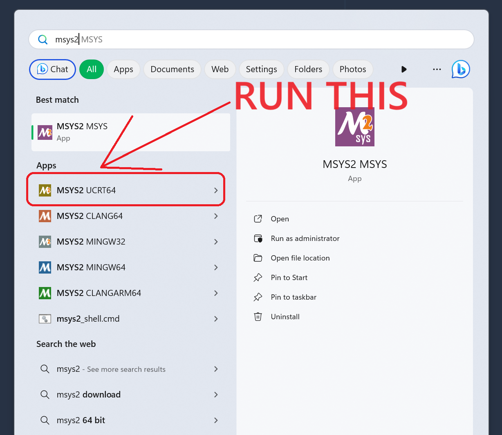
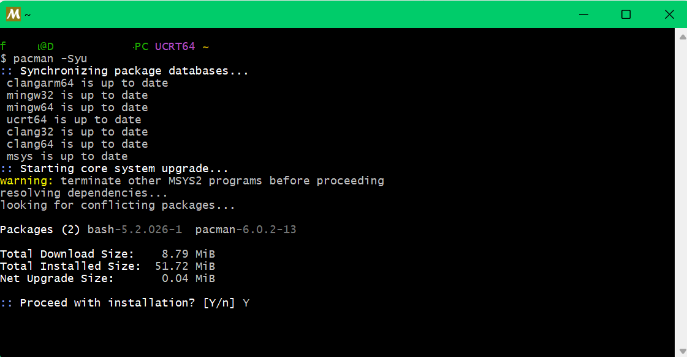
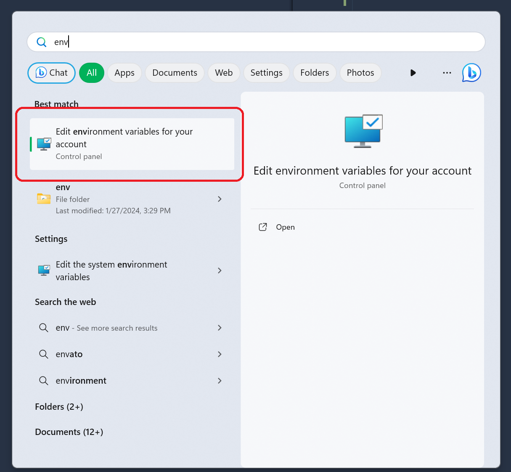
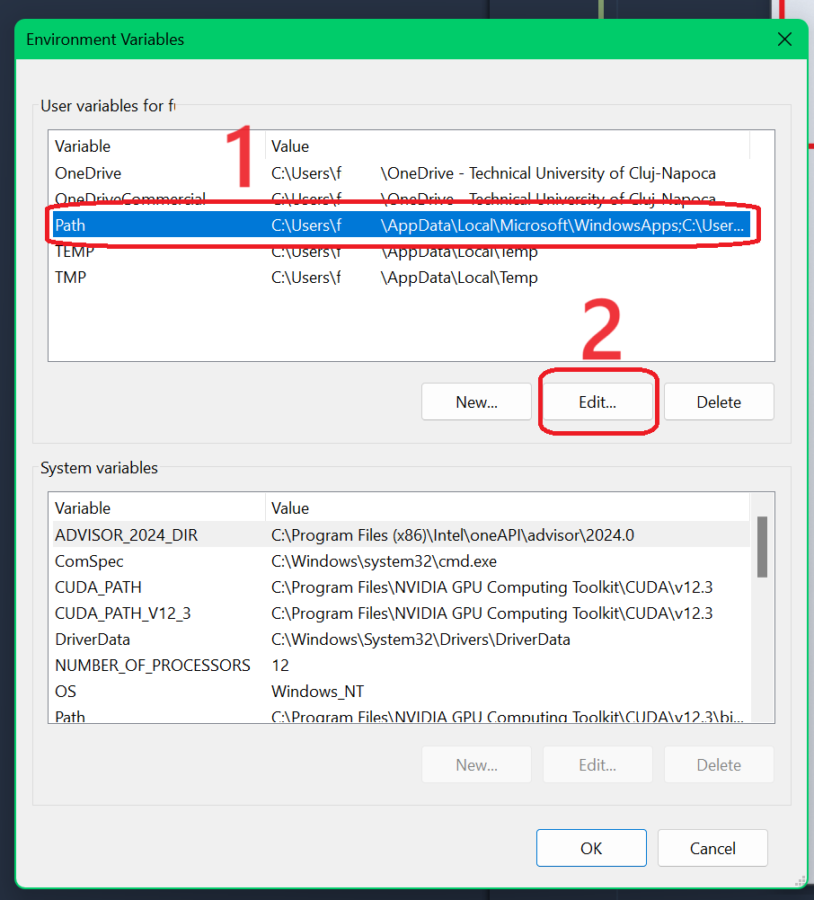
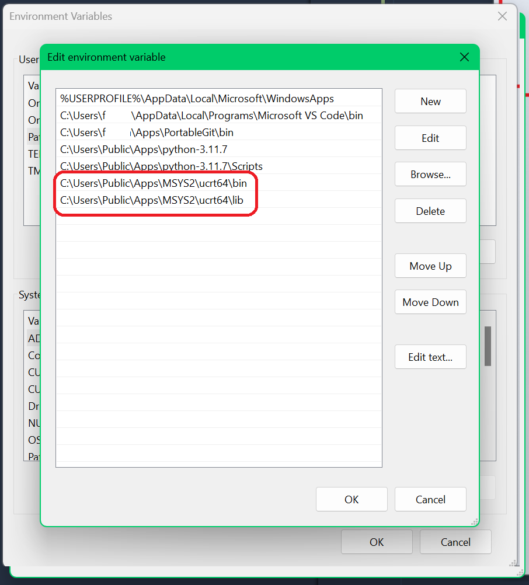

# IP Labs Cross-Platform Starter

## Introduction
This is a sample starter project for the [Technical University of Cluj-Napoca](https://www.utcluj.ro/) - [Faculty of Automation & Computer Science](https://ac.utcluj.ro/) - [Computer Science Department](https://cs.utcluj.ro/) :arrow_forward: :arrow_forward: [Image Processing](https://users.utcluj.ro/~onigaf/files/IP.html) English language [laboratories](http://users.utcluj.ro/~igiosan/teaching_ip.html)

## Platform specific setup

### Windows
**!!! _IMPORTANT_ !!!** This setup is meant to be used **WITHOUT** Visual Studio. If you want to use Visual Studio, then just simply download the starter project specific to your Visual Studio version from the labs homepage. Visual Studio can be a _**HUGE** resource hog_, so in case you don't want to use it and would rather use the mich more lightweight [Visual Studio Code](https://code.visualstudio.com/), then this is the setup for you.  

#### MSYS2
1. Since we are going to use VS Code as our IDE, we need to install a compiler and a build system. For this we are going to use [MSYS2](https://www.msys2.org/), which is a minimal unix-like environment for Windows that uses [pacman](https://wiki.archlinux.org/index.php/pacman) as its package manager for easy installation of packages and other dependencies that you will need.  
From the [MSYS2 homepage](https://www.msys2.org/), download the installer and run it.

2. Once you have installed it, run the **UCRT64** based shell. To paste text into the shell, right click on the title bar and select `Edit` -> `Paste` or press `Shift` + `Insert`.

Inside the shell, run the following commands to update the package database and upgrade the packages to the latest version. When asked, please confirm the installation of the packages by typing `y` and pressing `Enter`.
   ```bash
   pacman -Syu
   ```
   
The terminal might want to close in case of some critical updates, such as `pacman`, please confirm that as well and then open the shell again.

3. Next, you will want to install the following packages:
    ```bash
    pacman -S base-devel mingw-w64-ucrt-x86_64-clang mingw-w64-ucrt-x86_64-lldb mingw-w64-ucrt-x86_64-ninja mingw-w64-ucrt-x86_64-cmake mingw-w64-ucrt-x86_64-opencv mingw-w64-ucrt-x86_64-qt6-5compat
    ```
    

4. Now that you have installed all the packages, you will need to add the MSYS2 binaries to your `PATH` environment variable. Go ahead and open the `Edit environment variables for your account` window by searching for it in the start menu.
    

5. Click on the `Path` variable and then click on `Edit`
    

6. Add the following new entries to the list:
    ```bash
    C:\<PATH_TO_WHERE_YOU_INSTALLED_MSYS2>\ucrt64\bin
    C:\<PATH_TO_WHERE_YOU_INSTALLED_MSYS2>\ucrt64\lib
    ```
    

    **NOTE**: In my case, I installed MSYS2 in `C:\Users\Public\Apps\MSYS2`, yours might be different, so please make sure to use the correct path.

    Afterwards, click on `OK` in all of the dialogs / windoes to save the changes.

7. Now, go ahead and fire up VS Code, where you will need to install the [C/C++ extension](https://marketplace.visualstudio.com/items?itemName=ms-vscode.cpptools) for VS Code. To do this, open VS Code and click on the `Extensions` icon in the left sidebar. Then search for `C/C++` and click on `Install`.

8. Once the extension is installed, then go ahead and open the project from GitHub in VS Code. When the project is opened, you should configure CMake 

### Linux

### MacOS